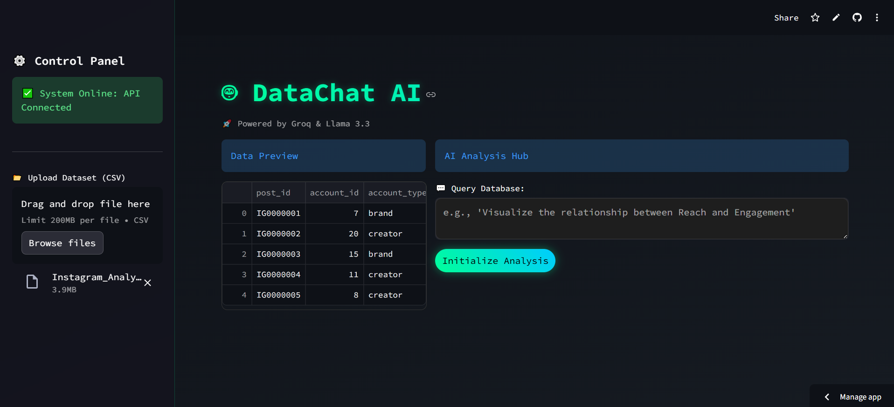
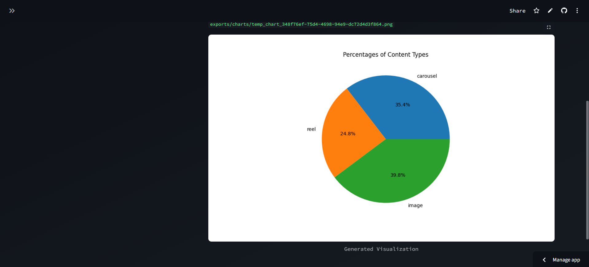

# 🤖 Datachat AI

> **Chat with your data in plain English. Powered by Llama 3.3 & Groq.**

[](https://datachatmkay.streamlit.app/)


## Overview
Datachat AI is an intelligent data analysis tool that allows users to upload CSV files and ask questions in natural language. Instead of writing complex Python or SQL queries, you simply ask: *"Which category has the highest sales?"* or *"Show me a bar chart of monthly growth,"* and the AI generates the  insights and visualizations almost instantly.
It is currently limited by the API's free tier (since the project is for personal experimentation), so you may run into rate limiting problems when running the app. 

It is built with **Streamlit** for the frontend and uses **Groq's LPU inference engine** running **Llama 3.3 70B** for fast responses.

## ✨ Features
* **🗣️ Natural Language Analysis:** Chat with your CSV file as if it were a human analyst.
* **⚡ Blazing Fast:** Powered by Groq's LPU, providing near-instant AI inference.
* **📊 Auto-Visualization:** Automatically generates Bar charts, Line charts, and Pie charts based on your query.
* **🔐 Secure:** API keys are handled safely via Streamlit Secrets; no keys are stored in the code. 
* **🎨 Cyberpunk UI:** Custom CSS styling for a modern, dark-mode aesthetic.

## 🛠️ Tech Stack
* **Frontend:** [Streamlit](https://streamlit.io/)
* **AI Model:** [Llama 3.3 70B](https://llama.meta.com/) via [Groq API](https://groq.com/)
* **Orchestration:** [PandasAI](https://github.com/gventuri/pandas-ai)
* **Connector:** [LiteLLM](https://github.com/BerriAI/litellm)
* **Language:** Python 3.11

## 📸 Screenshots





## ⚙️ Installation & Local Setup

If you want to run this app on your own machine:

1.  **Clone the repository**
    ```bash
    git clone [https://github.com/mkay860/datachat.git](https://github.com/mkay860/datachat.git)
    cd datachat
    ```

2.  **Create a virtual environment**
    ```bash
    python -m venv venv
    # Windows:
    .\venv\Scripts\activate
    # Mac/Linux:
    source venv/bin/activate
    ```

3.  **Install dependencies**
    ```bash
    pip install -r requirements.txt
    ```

4.  **Set up API Key**
    * Create a folder `.streamlit` in the root directory.
    * Create a file `secrets.toml` inside it.
    * Add your Groq API key:
        ```toml
        GROQ_API_KEY = "gsk_YourKeyHere"
        ```

5.  **Run the App**
    ```bash
    streamlit run app.py
    ```

## 🤝 Contributing
Contributions, issues, and feature requests are welcome! Feel free to check the [issues page](https://github.com/mkay860/datachat/issues).


---
*Built by [Mohammad Khattak](https://github.com/mkay860)*
